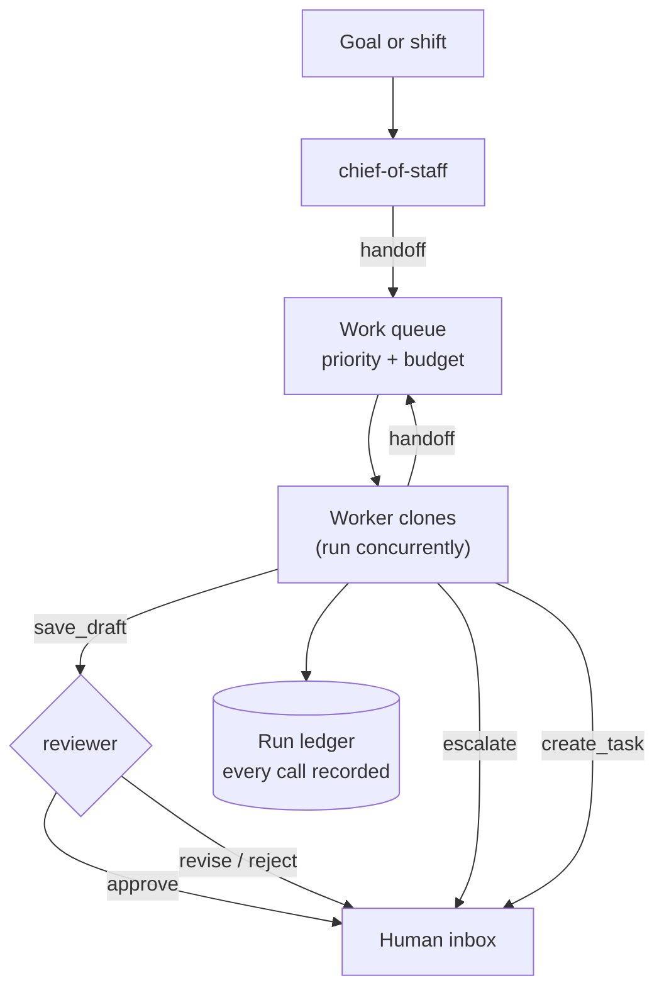

# Vision Analytical - Agent Office

An autonomous B2B worker harness: an office of role-specialised Claude clones that
work the lab-instrument business end to end - service triage, AMC renewals, lead
qualification, quotations, IQ/OQ/PQ scoping, customer outreach and the daily digest.

Every clone shares the same firm, the same records and the same hard rules. They
differ in charter, in the tools they are trusted with, and in what they are allowed
to say. Nothing they produce is sent anywhere - each run ends in a pile of drafts,
tasks and escalations for a human.

```bash
cd agent-office
node bin/office.mjs doctor              # check config, data, roles
node bin/office.mjs run --shift daily   # run the morning desk
node bin/office.mjs inbox               # read what the office produced
```

With no `ANTHROPIC_API_KEY` set, the office runs on an offline stub provider: the
full machinery executes - tools, handoffs, the review gate, the ledger - with no
model calls and no network. Set the key for real reasoning.

## How a run works



A run is seeded two ways. `--shift <name>` drops a preset list of work items straight
onto the right desks. `--goal "<text>"` hands the goal to the chief of staff, who reads
the book and delegates. Either way the queue drains until it is empty or the work-item
budget is spent, and the run ends with `out/runs/<id>/report.md`.

## The office

| Clone | Owns | May state a price | May review |
|---|---|---|---|
| `chief-of-staff` | What the office works on today, and who does it | no | no |
| `lead-research` | The truth about an account before anyone sells | no | no |
| `qualifier` | Whether a lead earns our engineering time | no | no |
| `quotation` | Line-item quotations sourced from the pricebook | **yes** | no |
| `amc-renewal` | The renewal book, lapsed contracts, multi-year asks | yes (AMC tiers) | no |
| `service-scheduler` | Ticket triage, engineer assignment, SLA defence | no | no |
| `qualification-compliance` | IQ/OQ/PQ scope, regime fit, requalification timing | no | no |
| `outreach-writer` | Email and WhatsApp in the firm's voice | no | no |
| `ops-reporter` | The end-of-desk digest | no | no |
| `reviewer` | The gate every draft passes before a human sees it | no | **yes** |

Charters live in `roles/*.md` - plain markdown with a small frontmatter block. Adding a
clone to the office is one file; the loader, the CLI and the handoff roster pick it up.

```markdown
---
name: spares-desk
title: Spares Desk - quotes and tracks consumable orders
tier: worker
tools: [list_records, pricebook_lookup, save_draft, escalate]
description: Handles column, spare and consumable enquiries.
---

You handle spares...
```

## What keeps it safe to leave running

- **Dry run by default.** Every deliverable is a file under `out/drafts/`. There is no
  send path, no CRM write, no email client. `--live` only turns off the dry-run banner;
  it still cannot reach a customer.
- **Reads are sandboxed** to `data/`, writes to `out/`. Collection names are validated
  and path traversal is refused.
- **A review gate on every draft.** Anything a clone writes is automatically queued for
  the `reviewer`, which checks figures against the pricebook, catches unsourced prices,
  compliance claims, invented dates and remote diagnoses stated as fact, then records
  `approve` / `revise` / `reject` onto the draft itself.
- **Only the quotation desk may state a price**, and only from a pricebook SKU. A
  lookup that misses tells the clone to escalate rather than invent.
- **Bounded autonomy.** Handoff depth, work-item budget, per-agent step budget and
  token cap are all in `office.config.json`. Clones cannot delegate in circles.
- **Escalation is a first-class outcome.** Above the approval threshold or the discount
  ceiling, the office stops and asks.
- **Everything is on the record.** `out/runs/<id>/ledger.jsonl` carries every model
  turn, tool call, draft, review, task and escalation with timestamps.

## Commands

| Command | What it does |
|---|---|
| `office run --shift daily` | Run a preset shift (`daily`, `renewals`, `service`, `newbiz`) |
| `office run --goal "..."` | Hand a goal to the chief of staff to plan and delegate |
| `office run --only amc-renewal` | Restrict a run to named desks |
| `office run --concurrency 5 --budget 60` | Widen the office for a bigger sweep |
| `office roles` | The bench, and what each clone may touch |
| `office shifts` | Preset shifts and their seed items |
| `office inbox` | Drafts waiting for a human, with review verdicts |
| `office doctor` | Validate config, data, role charters and tool grants |
| `office sync-agents` | Mirror the charters into `.claude/agents/` as Claude Code subagents |

## The data

`data/` holds the office's world as plain JSON - `company`, `customers`, `leads`,
`instruments`, `amc-contracts`, `service-tickets`, `pricebook`, `engineers`, `shifts`.
The shipped records are realistic sample data for a Maharashtra/Gujarat lab-instrument
business, not real customers. Replace them with an export of your own and the office
works your book instead; `office doctor` tells you if the shape is wrong.

A CRM adapter would slot in at `src/store.mjs` - it is the only module that touches
records, and every tool goes through it.

## Running it inside Munder Difflin

The same charters also ship as [Munder Difflin](https://munderdiffl.in) hire manifests, so the
office can run as a watchable floor of clones instead of a headless queue:

```bash
node bin/office.mjs sync-hires    # regenerate hires/ from roles/*.md
```

`hires/*.hire.json` validate against the published `munder-difflin/hire@1` schema (checked in
`test/hires.test.mjs` against a copy of the upstream schema). Import one from the office floor:
**Add agent -> import hire...**. Importing never spawns anything - it only pre-fills the dialog.

Each desk keeps its own sprite and routing tags, so Michael (chief-of-staff) can delegate to
Dwight (service), Angela (quotation), Andy (renewals) and the rest by capability.

`deploy/` carries a VPS kit: `preflight.sh` checks the box, `install.sh` builds the app and
registers systemd units behind an SSH tunnel, and `deploy/README.md` walks through it in Hindi.
Read the caveat at the top of that file first - the upstream project targets a desktop, not a
headless server.

## Testing

```bash
node --test test/*.test.mjs
```

42 tests cover the role loader and tool grants, the queue's priority and budget, the
tool-use loop (tool errors, step exhaustion, API failure, tool isolation), the store's
sandbox, the tool guardrails, full offline runs including the review gate, and the generated hire manifests against the upstream schema. The
live Anthropic HTTP call is the one path not covered - it needs a key.

## Configuration

`office.config.json`:

| Key | Meaning |
|---|---|
| `models.planner` / `.worker` / `.reviewer` | Model per tier; a role can override with `model:` in its frontmatter |
| `limits.concurrency` | Clones working at once |
| `limits.maxWorkItems` | Hard budget for a whole run |
| `limits.maxHandoffDepth` | How far work can be delegated onward |
| `limits.maxStepsPerAgent` | Tool-loop steps before a clone is stopped |
| `policy.quoteApprovalThresholdInr` | Above this, quotes need a human |
| `policy.discountCeilingPct` | Discount a clone may apply unaided |
| `policy.amcRenewalLookaheadDays` | When renewal outreach begins |
| `policy.serviceSlaHours` | Response SLA per severity |

Policy values are briefed into every clone's system prompt, so changing the threshold
changes what the office escalates - not just what the report says.
