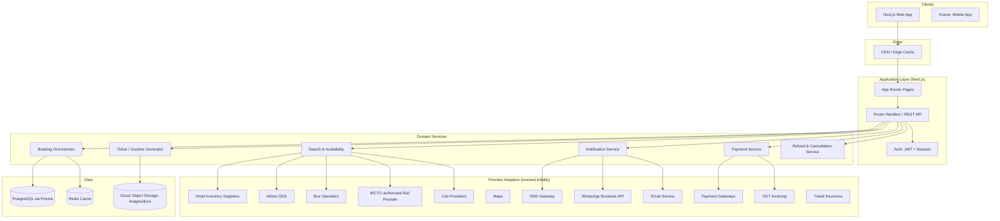
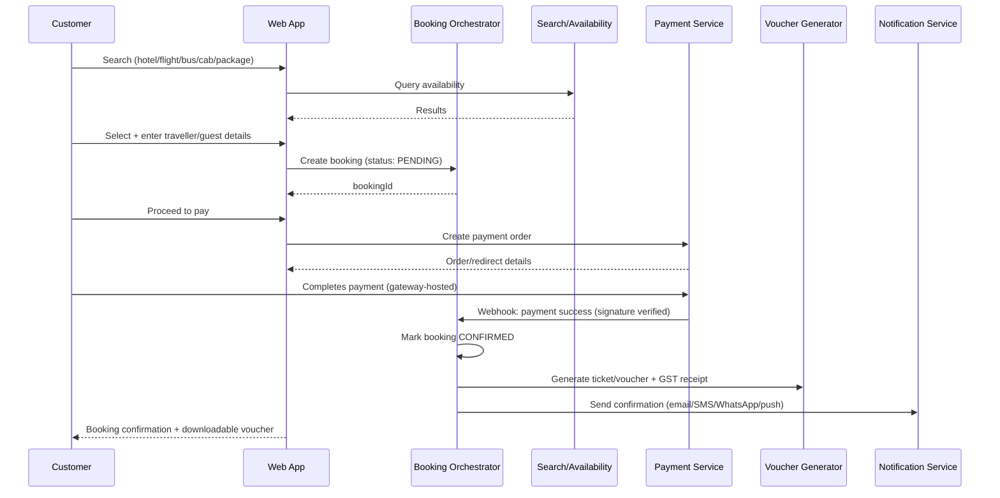

# BharatStay — Architecture

## 1. Overview

BharatStay is a multi-vertical travel booking platform (hotels, flights, buses, trains, cabs, packages, activities) serving four audiences through separate authenticated surfaces:

- **Customers** — search, book, pay, manage bookings
- **Property partners** — list & manage properties, inventory, pricing, bookings, settlements
- **Travel agents (B2B)** — book on behalf of customers at net rates with markup/commission control
- **Corporate accounts** — policy-governed employee travel booking with approvals & billing
- **Admins** — platform-wide operational and financial control



## 2. Provider-adapter pattern

Every third-party integration (payments, GDS, hotel inventory, SMS, WhatsApp, email, maps, GST, insurance) is accessed through a narrow TypeScript interface defined in the domain layer, e.g.:

```ts
// src/lib/sms.ts
export type SmsResult = 'sent' | 'mock' | 'failed';
export function deliverSms(phone: string, body: string): Promise<SmsResult>;
```

**Payments do not use this pattern — there is no gateway at all.** Money moves
over UPI straight from the customer's app to the owner's bank account
(`src/lib/upi.ts` builds the `upi://pay` deep link and its QR). Nothing calls
back to tell the site that money arrived, so the customer submits the 12-digit
UTR, the booking sits in `AWAITING_VERIFICATION`, and an admin confirms it
against the bank statement. This trades automation for zero fees and no
merchant account; the UI states the trade-off to the customer rather than
implying an instant confirmation.

The same pattern applies to: `HotelInventoryProvider`, `FlightSearchProvider` (GDS), `BusInventoryProvider`, `RailSearchProvider` (IRCTC-authorised), `CabProvider`, `SmsProvider`, `WhatsAppProvider`, `EmailProvider`, `MapsProvider`, `GstInvoiceProvider`, `InsuranceProvider`.

**Never** hard-code provider secret keys. All provider adapters read credentials from environment variables listed in `.env.example`; the mock adapters used in this scaffold require no credentials at all.

## 3. Booking workflow (all verticals)



## 4. Payment & receipt flow

- Checkout is a 6-step flow: **Review → Traveller/Guest details → Add-ons → Coupon/GST → Payment → Confirmation**.
- On successful payment, the system generates (a) a booking-type-specific **voucher/ticket** (hotel voucher, flight e-ticket, bus ticket, cab voucher, package voucher, activity ticket) and (b) a **GST payment receipt**, both with a verification QR code.
- Offline/bank-transfer payments go through a **pending → admin-verified** approval state (`PaymentProof` model) before a booking is confirmed.
- Payment webhook handlers **must** verify gateway signatures before mutating booking state — this is stubbed in `MockPaymentProvider.verifyWebhookSignature`.

## 5. Refund & cancellation workflow

States: `REQUESTED → UNDER_REVIEW → APPROVED → REFUND_INITIATED → COMPLETED` (or `REJECTED` at any review point). Modeled by `RefundRequest` in the Prisma schema, surfaced in both the customer dashboard (request/track) and admin dashboard (approve/reject/initiate).

## 6. Security baseline

- Passwords hashed (bcrypt/argon2) — never stored in plaintext; not yet wired to a real auth provider in this scaffold.
- JWT/session-based auth with short-lived access tokens.
- Role-based access control: `CUSTOMER`, `PARTNER`, `AGENT`, `CORPORATE_ADMIN`, `CORPORATE_TRAVELER`, `ADMIN`, `SUPER_ADMIN` (see `docs/ROLES.md`).
- All mutating API routes are intended to sit behind CSRF protection, rate limiting, and input validation (zod schemas) at the boundary.
- File uploads (payment proofs, KYC docs, property photos) are validated by type/size and stored in object storage, never inline in the DB.
- Audit log model (`AuditLog`) captures who changed what, when — required for admin actions on payments, refunds, and property approvals.
- No payment gateway secret keys, DB credentials, or API secrets are ever read from anywhere but environment variables; `.env.example` documents every variable with an empty placeholder.

## 7. Directory structure

```
bharatstay/
  docs/                     Architecture, sitemap, roles, roadmap, deployment docs
  prisma/
    schema.prisma           Full domain data model
  src/
    app/                    Next.js App Router pages (see docs/SITEMAP.md)
    components/             Reusable UI components (header, hero, sections, cards, vouchers, dashboards)
    lib/
      mock-data/            Demo dataset (hotels, destinations, offers, packages, flights, buses, cabs, reviews)
      providers/            Provider-adapter interfaces + mock implementations
      types.ts              Shared domain TypeScript types
      utils.ts              Formatting & helper utilities
  .env.example
  package.json
```
