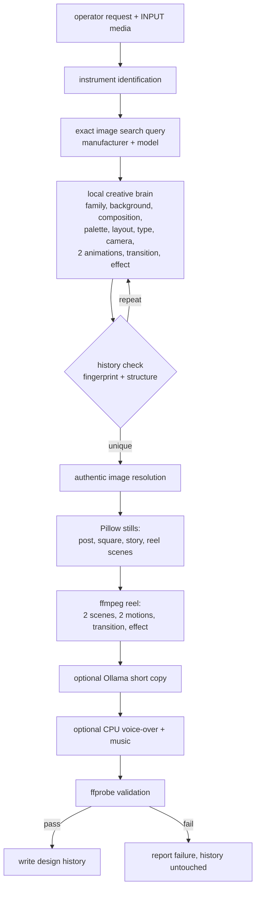

# Vision Analytical - AI Creative Media System

Local-first generator for premium analytical-instrument social content: one
command produces a square post, a portrait post, a story, a phone reel, a
caption and a full metadata/validation report.

> **Automatic generation is off and stays off.** There is no timer, no service
> and no cron entry in this package, and the engine refuses to run when it
> detects a systemd invocation. Content is produced only when a person runs the
> command.

## Where it runs

The engine is designed for the Vision Analytical Ubuntu server (no GPU) and
installs alongside what is already there:

| Path | Role |
|---|---|
| `/usr/local/bin/vision-ai-content` | the command (backed up before replacement) |
| `/srv/vision-workspace/vision-ai/engine` | Python engine |
| `/srv/vision-workspace/vision-ai/creative-pack` | creative libraries + design history |
| `/srv/vision-mobile/INPUT/{PHOTOS,VIDEOS,MUSIC}` | operator input (never deleted) |
| `/srv/vision-mobile/OUTPUT/READY` | finished files |
| `/srv/vision-workspace/vision-media-studio/{tmp,audio}` | working files |

Every path is configurable in `creative-pack/config/engine.json` or by
environment variable (`VISION_AI_OUTPUT_READY`, `VISION_AI_ROOT`, …).

## Install

```bash
cd vision-ai
sudo ./install.sh --dry-run     # show exactly what would change
sudo ./install.sh               # install (reuses existing dirs, backs up the old command)
sudo ./install.sh --with-deps   # also apt-installs ffmpeg / Pillow / fonts if missing
vision-ai-content --doctor      # verify paths, libraries, ffmpeg, ollama, timer state
```

The installer never overwrites a creative-pack file you have edited, never
touches `INPUT/` or `OUTPUT/`, and never creates or enables a timer.

## Generate

```bash
sudo vision-ai-content "AMC for Agilent 1260 II HPLC"
sudo vision-ai-content "IQ/OQ/PQ for Shimadzu UV-1900i" --no-ollama
sudo vision-ai-content "Refurbished Waters Alliance e2695" --voice --no-music
vision-ai-content "Agilent 8890 GC" --dry-run          # pick a design, render nothing
vision-ai-content --history 20                          # what has been generated
vision-ai-content --benchmark 200                       # local selection speed
```

Output lands in `/srv/vision-mobile/OUTPUT/READY`:

```
Vision-Analytical-YYYYMMDD-HHMMSS-POST.png     1080x1350 portrait
Vision-Analytical-YYYYMMDD-HHMMSS-SQUARE.png   1080x1080 square
Vision-Analytical-YYYYMMDD-HHMMSS-STORY.png    1080x1920 story
Vision-Analytical-YYYYMMDD-HHMMSS-Reel.mp4     1080x1920 H.264/AAC 30fps 15-30s
Vision-Analytical-YYYYMMDD-HHMMSS-Caption.txt
Vision-Analytical-YYYYMMDD-HHMMSS-Info.txt     design + validation report
```

## How a run works



Local Python makes every design decision (about 0.2 ms per design). Ollama is
asked only for a headline and a call to action, capped at a few words and a few
seconds, and any failure silently falls back to the local templates.

## Posting to Instagram

The token goes in `creative-pack/config.env` on the server. That file is never
committed and nothing here ever prints a token in full.

```
META_APP_ID=...
META_APP_SECRET=...
META_ACCESS_TOKEN=...        # a USER token - an app token (id|secret) cannot post
IG_USER_ID=...               # optional, --check tells you the number
```

```bash
python3 vision-ai/brain/instagram.py --check        # what the token is and what it may do
python3 vision-ai/brain/instagram.py --long-lived   # 1-hour token -> 60-day token
python3 vision-ai/brain/instagram.py --post-latest             # dry run
python3 vision-ai/brain/instagram.py --post-latest --apply     # publish
```

`--check` reports the token type, its expiry, the permissions actually granted,
which Instagram account it reaches (through a Facebook Page or through
Instagram Login), and how much of the 50-posts-per-day quota is used. Each
failure comes with the specific fix rather than the raw Graph API error.

**Instagram downloads the video itself**, so the reel must sit on a public
HTTPS URL - a local path will not work. Either pass `--video-url`, or point the
script at a folder your web server already serves:

```
INSTAGRAM_PUBLIC_DIR=/srv/public/reels
INSTAGRAM_PUBLIC_BASE=https://your-domain/reels
```

Publishing is a dry run until `--apply`. The reel's own `-Caption.txt` is used
as the caption unless `--caption-file` says otherwise. If Meta reports that the
API version is gone, set `META_API_VERSION` to the current one.

## Checking the photo folders

The folder name is the only claim that a photo shows a given instrument, and a
phone dump drops mixed shots into one place. A wrong photo there reaches a real
post, so review it before it does:

```bash
python3 vision-ai/brain/photo_review.py --audit    # group each folder, mark what does not fit
python3 vision-ai/brain/photo_review.py --sheet    # numbered contact sheet per folder
python3 vision-ai/brain/photo_review.py --move shimadzu/lc-2010cht 4,7,9 shimadzu/uv-1900i
```

Nothing here recognises instruments. It fingerprints each photo twice - where
the light sits and which way it steps - and groups what looks alike; the
largest group is taken as the instrument the folder is named for and anything
else is flagged for a human look. `--move` is a dry run until `--apply`, and it
deletes the moved photo's cached cutout so the old background never comes back
in the new folder.

## Instrument identity rules

- The manufacturer and model in the request are the ones used, everywhere.
- `IMAGE_SEARCH_QUERY` always contains the exact manufacturer + exact model.
- A photo is used only when it is the requested model: a file named
  `Agilent-1260-...jpg` is never used for a 1290 request.
- With no authentic photo, the design is rendered typographically and the
  Info file says so - the engine never shows a different instrument and never
  invents hardware.
- Curated authentic photos live in
  `creative-pack/images/<manufacturer>/<model>/` and rotate between runs.

## A reel every N hours

Automatic generation is off by default and the engine refuses to run unattended
unless it is told otherwise, so it can only happen through this one unit.

```bash
sudo ./schedule.sh --every 2h --requests requests-shimadzu.txt --voice-lang en-in
sudo ./schedule.sh --status      # is it on, what fires next, what the last run did
sudo ./schedule.sh --run-now     # fire once by hand, exactly what the timer does
sudo ./schedule.sh --off         # remove it completely
```

The request list is one line per firing and the timer walks down it, so
consecutive reels are for different instruments and different campaigns rather
than the same one all day. Comments and blank lines are skipped, and the list
can be edited while the timer runs - the change is picked up on the next
firing. Design, palette, layout, voice, music and the photo rotate on their own,
so the same line twice does not give the same reel.

The unit runs at `Nice=10`, `IOSchedulingClass=idle` and `CPUQuota=300%` - one
reel at a time, never at the expense of Nextcloud, Jellyfin or n8n. Missed
firings are not made up, so downtime leaves a gap rather than a burst.

Delivery goes through the operator's own chain: the package lands in
`OUTPUT/READY` and their `vision-mobile-final-sync` / `vision-ipad-sync` timers
carry it to the phone folder. No new sync script, no new timer for delivery.

### Keeping more than the newest reel

`vision-ipad-sync` empties the phone folder before every copy, so on a two-hour
timer each reel deletes the one before it.

```bash
sudo ./schedule.sh --keep 12     # the newest 12 reels stay on the phone
sudo ./schedule.sh --keep off    # back to newest-only
```

That patches one line of their script, keeps a backup first, and `--keep off`
restores the original byte for byte. Reels are grouped by timestamp so every
file of a kept reel survives together, and anything in the folder that is not a
generated reel is never touched. `--status` reports which mode is in force.

## Why posts stopped looking alike

Two things were quietly flattening every run.

**The stills never went through the design system.** The engine writes one
poster - the photo, a white headline, a small wordmark - and the brain only
replaced the reel. Whatever palette, layout and background were chosen reached
the video and nothing else. The brain now re-renders `POST` (1080x1350) and
adds `SQUARE` (1080x1080) and `STORY` (1080x1920) through the same renderer,
overwriting the engine's poster in place so the existing sync chain still
finds it.

**One preset name meant one library entry.** The server brain's whole
vocabulary is about five family names, four layout names and six motion names.
Resolving each name to exactly one entry pinned 42 real runs onto 4 layouts
and 5 families, while the fields the local selector owned used 93-100% of
their libraries. A preset name now resolves to a *band* of entries that all
match it; the literal best match stays the favourite, but recency steers each
run away from what just went out.

| | library | 42 runs before | 13 runs after |
|---|---|---|---|
| layout | 25 | 4 | 11 |
| design family | 26 | 5 | 9 |
| transition | 15 | 5 | 9 |
| animation 2 | 25 | 8 | 9 |

`verify.sh` now reports library coverage over the last 30 runs and warns when
any of them drops below 35%. Tuning knobs, all optional:

| key | default | effect |
|---|---|---|
| `BRAIN_PRESET_POOL` | 8 | how many entries one preset name may reach |
| `BRAIN_ROTATION_WINDOW` | 12 | how far back recency looks |
| `BRAIN_TRUST_SERVER` | 0 | `1` restores the literal one-name-one-entry mapping |

## Anti-repetition

Each design has a SHA-256 fingerprint over manufacturer, model, family,
background, composition, palette, layout, typography, camera, both animations,
transition, effect, music and voice. A run rejects a design when

- the fingerprint already exists in the last 1000 records, or
- `background + composition + layout` was used in the last 10 records, or
- `animation_1 == animation_2` (never possible - the sampler draws without
  replacement).

Recently used values are down-weighted, so families, palettes, backgrounds and
effects rotate rather than clustering.

## Creative libraries

`creative-pack/` is plain JSON and is meant to be edited on the server:

| Library | Count |
|---|---|
| design families | 20 |
| backgrounds | 15 |
| compositions | 15 |
| layouts | 20 |
| palettes | 18 |
| typography sets | 8 |
| animations | 25 |
| camera framings | 10 |
| transitions | 15 |
| effects | 20 |
| music styles | 12 |
| voice styles | 6 |
| instrument knowledge | 12 manufacturers, 12 techniques, 30 models, 8 services |

## Video contract

1080x1920, 30 fps, H.264 High, yuv420p, AAC-LC 192k @ 48 kHz, `+faststart`,
bitrate capped so files stay phone- and WhatsApp-friendly. Every file is
checked with `ffprobe` before it is reported as delivered; a failed check
means nothing is written to design history.

### Length follows the narration

A silent reel is 15 s. With `--voice` the reel is as long as the narration
needs, because a sentence cut in half is worse than a reel that runs a little
long:

| Narration | Reel |
|---|---|
| under ~13 s | 15 s (`REEL_MIN_SECONDS`) |
| 13-28 s | narration + 2.2 s of lead-in and tail |
| over 28 s | the speaker is paced up to 1.18x to fit `REEL_MAX_SECONDS` (30 s) |
| longer than even that allows | the reel runs past 30 s rather than truncating |

The encoder's bitrate ceiling is recalculated from the final length, so a 30 s
reel is still under the size limit. Set `REEL_MIN_SECONDS` / `REEL_MAX_SECONDS`
in the env file to change the window.

## Logo

The brand logo keeps its own colours. A logo file that is artwork on solid
white has the white keyed out per-channel, so the paper and the counters
inside letters go transparent while saturated brand colours stay fully
opaque. When the artwork would otherwise disappear into the background it is
given a tight rounded card instead of being repainted. `LOGO_MONO=1` forces
the old single-colour knockout.

## Tests

```bash
python3 vision-ai/tests/test_engine.py        # full suite (includes an ffmpeg sweep)
python3 vision-ai/tests/test_engine.py -q     # skip the ffmpeg sweep
```

The sweep renders every animation, every transition and every effect through
ffmpeg to prove the filtergraphs are valid.

## Optional pieces

- **Ollama** - short copy only. `--no-ollama` disables it; if the container is
  down the run is unaffected.
- **Voice-over** - off by default. `--voice` uses `piper` (with
  `--piper-model`) or `espeak-ng` if either is installed. Nothing is downloaded.
- **Music** - only tracks in `INPUT/MUSIC` are used. With none, the reel gets a
  silent AAC track so the phone-compatibility contract still holds.
- **ComfyUI** - not required. The pipeline is Pillow + ffmpeg on CPU.
