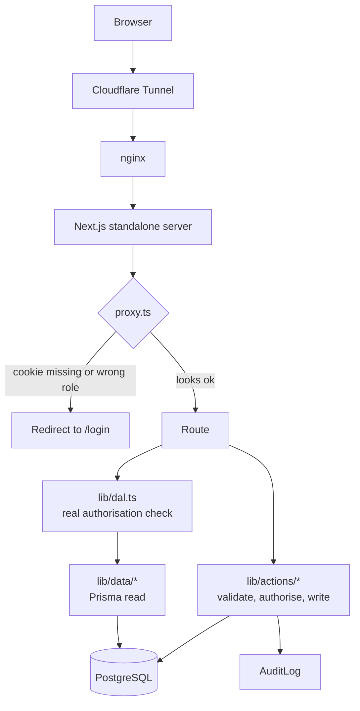

# Project structure

What each folder is for and why the code is arranged this way. For build and
deploy commands, see [DEPLOYMENT.md](./DEPLOYMENT.md).

---

## Top level

```
vision-analytical/
├── src/                 Application source
├── prisma/              Database schema, migrations, seed
├── public/              Static assets served as-is (includes uploads/)
├── deploy/              Docker Compose stack, nginx config, deploy env
├── docs/                Long-form documentation
├── tests/               Unit tests (node:test via tsx)
├── Dockerfile           Multi-stage production image
├── next.config.ts       Next.js config, security headers, CSP
├── prisma.config.ts     Prisma CLI config (schema path, seed command)
├── DEPLOYMENT.md        How to build, deploy, roll back
├── PROJECT_STRUCTURE.md This file
├── CONVENTIONS.md       Standing engineering rules for the project
├── AGENTS.md / CLAUDE.md  Instructions for AI coding sessions
└── README.md            Overview and feature list
```

> The repository root is an n8n fork; this application is the
> `vision-analytical/` subdirectory. All commands run from here.

There is **no** `scripts/` folder and **no** top-level `uploads/` folder in
this application — uploads live in `public/uploads/`.

---

## `src/app/` — routes

Next.js App Router. A folder becomes a URL; `(parentheses)` group routes
without appearing in the path.

```
src/app/
├── layout.tsx           Root layout: fonts, theme, providers
├── globals.css          Tailwind entry + design tokens
├── robots.ts            robots.txt
├── sitemap.ts           sitemap.xml
├── (auth)/              Login and registration — no site chrome
│   ├── login/
│   └── register/
├── (site)/              The public website
│   ├── about/  contact/  services/
│   ├── products/        Instrument catalogue, faceted
│   ├── spare-parts/     Parts store + parts finder + cart
│   ├── refurbished/     Refurbished instruments
│   ├── brands/          Brand hub pages
│   ├── blog/            Knowledge Center
│   ├── error-codes/     Error code lookup
│   ├── downloads/       Document centre (gated file delivery)
│   ├── search/          Global federated search
│   └── request-quote/
├── admin/               Staff back office (role ADMIN)
│   ├── products/  inventory/  orders/  quotes/  customers/  crm/
│   ├── engineers/  service-requests/  amc/
│   ├── blog/            Knowledge article editor
│   ├── team/            Employees, attendance, leave, devices, audit
│   ├── quality/         Data quality report
│   ├── reports/
│   ├── website/         CMS: homepage builder, pages, theme, media, settings
│   └── settings/        Feature flags
├── engineer/            Field engineer app (role ENGINEER)
├── portal/              Customer portal (role CUSTOMER)
└── uploads/[...path]/   Route handler serving uploaded files
```

**Route handlers do not run through layouts.** A handler under `/admin` is
unprotected unless it calls `requireRole` itself — including CSV exports and
file downloads.

---

## `src/components/` — UI

```
src/components/
├── ui/          Primitives: Button, Card, Table, Badge, Input, Select,
│                Textarea, FormField, StatCard, EmptyState, ImageInput,
│                Container, BarList, StatusBadge
├── layout/      Header, footer, nav, mega menu, dashboard shell
├── forms/       Form components bound to server actions
├── home/        Homepage sections (CMS-driven)
├── product/     Product cards, galleries, spec tables, filters
├── blog/        Article cards and knowledge listings
├── search/      Search box and result groups
├── team/        Team/HRMS forms and controls
├── admin/       Admin-only widgets
└── seo/         Structured data (schema.org) components
```

Server Components by default. A component is a Client Component only when it
needs interaction, and then it imports enums from `@/generated/prisma/enums`
(pure data) rather than `@/generated/prisma/client` (which has Node-only
imports that break a client bundle).

---

## `src/lib/` — logic

The layer split is what keeps the app testable and the routes thin.

```
src/lib/
├── data/        READ side. Every database query the UI uses.
├── actions/     WRITE side. Server actions: validate → authorise → write.
├── validation/  Zod schemas, one file per admin area.
├── cms/         CMS content defaults and types.
├── seo/         Metadata and structured-data builders.
│
├── db.ts             Prisma client singleton
├── dal.ts            Authorisation: requireRole, requireUser, getCurrentUser
├── session.ts        JWT cookie sign/verify
├── password.ts       bcrypt hashing
├── rate-limit.ts     In-process rate limiting (no Redis)
├── audit.ts          Audit trail writer (server-only)
├── audit-diff.ts     Pure before/after diffing — split out to be testable
├── attendance.ts     Attendance rules engine (pure)
├── attendance-sync.ts Punch → attendance pipeline (server-only)
├── punch-csv.ts      Device export parser (pure)
├── time-zone.ts      Wall-clock helpers for an explicit IANA zone
├── csv.ts            CSV export with formula-injection neutralisation
├── upload-image.ts   Validate, re-encode to WebP, strip metadata (lazy sharp)
├── media.ts          Uploaded-file listing and deletion
├── features.ts       Feature flag registry
├── content-status.ts Publishing workflow + publiclyVisibleWhere()
├── slug.ts           Slugify
└── …labels/format/status helpers
```

**Pure vs server-only is a deliberate split.** Logic that decides something
consequential — the attendance engine, timezone conversion, CSV escaping,
device parsing — lives in modules *without* `server-only` so it can be
imported directly by tests. Where a module has both halves, they are separate
files (`punch-csv.ts` / `attendance-sync.ts`, `audit-diff.ts` / `audit.ts`).

---

## `src/generated/prisma/` — build artifact

Generated by `prisma generate`, gitignored, recreated on install. Never edit.

- `client` — the full client (Node-only imports; server code only)
- `enums` — plain enum values, safe in Client Components

---

## `prisma/`

```
prisma/
├── schema.prisma        The single source of truth for the database
├── migrations/          Ordered, immutable SQL migrations
└── seed*.ts             Idempotent seed script and its reference data
```

**Migrations are append-only.** Never edit one that has been applied. A
migration that would lose data is hand-written so it backfills first and
asserts the backfill worked — aborting rather than silently dropping.

The seed is idempotent (upsert by slug/code) and safe to re-run on every
deploy. It never overwrites admin edits; it only fills in what is missing.

---

## `public/`

```
public/
├── uploads/     Runtime uploads — a Docker volume in production
└── …            Icons, logos, static images
```

`public/uploads/` is the only directory the application writes to. In Docker
it is the `deploy_uploads` volume, which is why it survives redeploys.

---

## `deploy/`

```
deploy/
├── docker-compose.yml   postgres, migrate, app, nginx, cloudflared
├── nginx/nginx.conf     Reverse proxy, caching, security headers
├── .env.example         Template for the stack's secrets
└── README.md            Short operational notes
```

No host ports are published. `cloudflared` is the only ingress.

---

## `docs/`

| File | Contents |
|---|---|
| `architecture-review.md` | Inventory of the platform; what was reused, extended, refactored, built new; risks |
| `attendance-devices.md` | The punch pipeline, what works, and the unbuilt vendor TCP adapter |

---

## `tests/`

`npm test` runs Node's built-in test runner through `tsx` — no test framework
dependency to keep current.

Covers the attendance engine, timezone conversion, CSV escaping, device-export
parsing and audit diffing. Everything else is verified by driving the running
application against a **production build**, because `next dev` recompiles can
add tens of seconds to a request and imitate an application bug.

---

## How a request flows



`proxy.ts` runs at the edge and does a cookie-only check — fast redirects for
the common case. It is **not** the security boundary. Every protected page,
action and route handler calls the DAL, which re-reads the user from the
database and confirms both role and active status.

---

## Architectural rules

The full set is in [CONVENTIONS.md](./CONVENTIONS.md). The ones that most
shape the folder layout:

1. **Model real entities, not free-text fields.** A value that will need a
   page, a filter or an attachment is an entity.
2. **Reads in `data/`, writes in `actions/`.** A page never queries directly.
3. **Validate at the boundary with Zod**, in `validation/`.
4. **Server Components by default**; client components only where interaction
   requires it.
5. **Pure logic stays importable** — no `server-only` on anything worth
   testing.
6. **Never hardcode a URL, secret or colour** — env and design tokens.
7. **Lazy-load native modules** (`await import()`) at point of use, or they get
   pulled into build-time analysis of routes that never call them.
