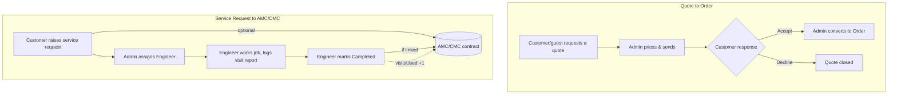

# Vision Analytical

Production platform for Vision Analytical — sales, refurbishment, spare
parts, service (AMC/CMC) and support for analytical lab instruments
(HPLC, GC, LC-MS, UV-Vis and related equipment).

## Tech stack

- **Framework:** Next.js 16 (App Router, Turbopack, Server Actions)
- **Language:** TypeScript
- **Database:** PostgreSQL via Prisma ORM 7 (driver adapters, `prisma-client` generator)
- **Styling:** Tailwind CSS v4
- **Auth:** Hand-rolled sessions — bcrypt password hashing, `jose` JWT cookies, a DAL
  (Data Access Layer) pattern for authorization checks
- **Images:** `sharp` (validate, re-encode to WebP, strip metadata)
- **Deployment:** Docker Compose — Postgres, the app, Nginx, and a Cloudflare Tunnel

## Features

Three roles, each with their own section and its own home page:

| Role | Section | Highlights |
|------|---------|------------|
| Guest / Customer | `/` (public site) | Instrument catalog, spare parts store, refurbished instruments, blog/knowledge center, quote requests, contact |
| Customer | `/portal` | Dashboard, orders, quotes (accept/decline), service requests, AMC/CMC contracts, invoices, profile |
| Engineer | `/engineer` | Assigned jobs, job history, visit reports, job status updates, profile |
| Admin | `/admin` | Dashboard, products & categories, inventory & suppliers, customers, orders, quotes (price & convert to order), CRM (leads & activities), engineers, service requests (assign & track), AMC/CMC contracts, reports, blog CMS, website builder (homepage sections, page content, header/footer nav, theme, media library, business settings) |

Core workflows tie the three roles together end-to-end:

- **Quote → Order:** a guest or customer requests a quote → admin prices and
  sends it → customer accepts/declines → admin converts an accepted quote
  into a tracked order.
- **Service Request → AMC/CMC:** a customer raises a service request
  (optionally linked to an active AMC/CMC contract) → admin assigns an
  engineer (auto-advances the request to *Assigned*) → the engineer works
  the job, logs a visit report, and marks it *Completed* → the linked
  contract's visit count updates automatically, visible to all three roles.



## Project structure

```
vision-analytical/
├─ prisma/
│  ├─ schema.prisma        # Domain model (19 models, ~15 enums)
│  ├─ migrations/          # Hand-authored SQL migrations
│  └─ seed.ts              # Idempotent seed: admin bootstrap, catalog, blog, optional demo data
├─ src/
│  ├─ app/
│  │  ├─ (site)/           # Public marketing + storefront routes
│  │  ├─ (auth)/           # Login / register
│  │  ├─ admin/            # Admin panel (role-gated)
│  │  ├─ engineer/         # Engineer dashboard (role-gated)
│  │  ├─ portal/           # Customer portal (role-gated)
│  │  ├─ sitemap.ts, robots.ts
│  │  └─ layout.tsx        # Root layout, global metadata, security headers (next.config.ts)
│  ├─ components/          # ui/, forms/, product/, layout/, seo/
│  ├─ lib/
│  │  ├─ data/              # Read queries, grouped by area (admin-*, portal, products, ...)
│  │  ├─ actions/           # Server Actions (mutations), grouped the same way
│  │  ├─ validation/        # Zod schemas, one file per form/action group
│  │  ├─ dal.ts, session.ts, roles.ts, safe-redirect.ts   # Auth stack
│  │  ├─ upload-image.ts    # Image validation + processing pipeline
│  │  └─ rate-limit.ts      # In-memory rate limiting for public forms
│  ├─ generated/prisma/     # Generated Prisma Client (gitignored, run `npx prisma generate`)
│  └─ proxy.ts              # Route-level auth gate (Next.js middleware equivalent)
├─ deploy/                  # Docker Compose, Nginx config, Cloudflare Tunnel setup
├─ Dockerfile
└─ .env.example
```

## Getting started (local development)

**Prerequisites:** Node.js 22+, npm, a local PostgreSQL 16 instance.

```bash
npm install
cp .env.example .env        # fill in DATABASE_URL, SESSION_SECRET, etc. (see below)
npx prisma generate
npx prisma migrate deploy   # applies committed migrations
npx prisma db seed          # catalog + blog content; creates the first admin if SEED_ADMIN_PASSWORD is set
npm run dev
```

Visit `http://localhost:3000`. Log in at `/login` with the admin account
you seeded (or `demo.customer@example.com` / `demo.engineer@example.com`
if you set `SEED_DEMO_DATA=true`, password from `SEED_DEMO_PASSWORD`).

### Environment variables

See `.env.example` for local development (full comments inline) and
`deploy/.env.example` for the Docker Compose stack. Key variables:

| Variable | Purpose |
|---|---|
| `DATABASE_URL` | Postgres connection string |
| `SESSION_SECRET` | Signs session JWTs — generate with `openssl rand -base64 32`; any authenticated request throws immediately if it's unset |
| `NEXT_PUBLIC_SITE_URL` | Canonical URL used for metadata, sitemap, OG/Twitter tags, JSON-LD |
| `NEXT_PUBLIC_WHATSAPP_NUMBER`, `NEXT_PUBLIC_CONTACT_PHONE`, `CONTACT_EMAIL` | Contact channels shown across the site — fallback used only until an admin sets the phone/WhatsApp number in Business Settings (`/admin/website/settings`), which then takes priority |
| `SEED_ADMIN_EMAIL` / `SEED_ADMIN_PASSWORD` | Bootstraps the first admin account (skipped once it exists — no default admin password ships in source control) |
| `SEED_DEMO_DATA` / `SEED_DEMO_PASSWORD` | Optional demo customer/engineer + sample records, for local dev only |

### Scripts

`npm install` runs `prisma generate` automatically via a `postinstall` hook,
so `src/generated/prisma` (gitignored, since it's generated code) always
exists after installing — no separate step required, though `npx prisma
generate` is safe to re-run any time the schema changes.

```bash
npm run dev     # Turbopack dev server
npm run build   # production build (standalone output)
npm run start   # copies public/ and .next/static into the standalone
                # output, then runs it directly with `node` - "next start"
                # doesn't support standalone output, so this is the
                # supported way to run the production build outside Docker
npm run lint    # ESLint
npx tsc --noEmit          # typecheck
npx prisma studio         # browse the database
npx prisma migrate dev    # create a new migration (interactive; see prisma/migrations for hand-authored examples if your environment can't run it interactively)
```

## Database

Prisma 7 with driver adapters (`@prisma/adapter-pg`) — see `prisma.config.ts`
for CLI configuration and `src/lib/db.ts` for the runtime client (a
`server-only`-guarded singleton).

The schema covers the full domain: users/roles, product catalog
(instruments + spare parts), refurbished instruments, orders, quotes, service
requests, AMC/CMC contracts + visit reports, invoices, CRM leads/activities,
blog posts, inventory (suppliers, stock movements), and contact messages.

`prisma/seed.ts` is idempotent — safe to re-run. It always seeds the catalog
and blog content; the admin account and demo data are opt-in via the env
vars above.

`npm run build` never needs a reachable database — every route is rendered
dynamically (`export const dynamic = 'force-dynamic'` in the root layout),
and the handful of data-fetchers that could otherwise run during a build
(site/theme settings, the sitemap) degrade to defaults instead of failing
if the database isn't up yet. This matters for standard deploy pipelines
(Docker build stages, CI) that build the app before the database container
exists.

## Image uploads

Product photos, refurbished-instrument photos, blog cover images, and
website content (homepage hero background, logo, favicon) are uploaded
from their respective admin forms. Every upload is decoded and re-encoded
through `sharp` (rejecting anything that isn't a genuine JPEG/PNG/WebP
regardless of its claimed content type), capped at 8MB, resized to a sane
max dimension, and written to a server-generated filename under
`public/uploads/` — never trusting the original filename or bytes.
In Docker, that directory is a named volume so uploads survive redeploys.
The Media Library (`/admin/website/media`) lists every uploaded file with
its size, upload date and whether it's still referenced anywhere on the
site, and lets an admin delete ones that aren't needed.

## Security

- Passwords hashed with bcrypt; sessions are `httpOnly`, `secure` (in
  production), `sameSite=lax` JWT cookies with the signing algorithm pinned.
- Every admin/engineer Server Action independently calls
  `requireRole`/`requireSession` — route-level gating (`proxy.ts`) is a fast
  path, not the security boundary.
- Content-Security-Policy and standard security headers (`X-Frame-Options`,
  `X-Content-Type-Options`, `Permissions-Policy`) are set both at the Next.js
  level (`next.config.ts`) and again at the Nginx reverse proxy.
- Rate limiting on login (per-account and per-IP), registration, the contact
  form and quote requests.
- Open-redirect protection on the post-login redirect (`safeRedirectPath`).

## SEO

Dynamic `sitemap.xml` (all published catalog items and blog posts, hourly
revalidation) and `robots.txt` (disallowing the private admin/engineer/portal
sections). JSON-LD structured data: `Organization` on the homepage, `Product`
on every instrument/spare-part/refurbished detail page, `BlogPosting` on
knowledge center articles. Open Graph and Twitter card defaults on the root
layout, overridden per-page where relevant.

## Deployment

See [`deploy/README.md`](./deploy/README.md) for the full Docker Compose
walkthrough (Postgres, the app, Nginx, and a Cloudflare Tunnel — no ports
published to the host).
