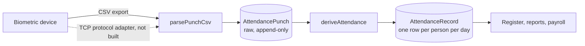

# Attendance devices

How punches get from the biometric device into attendance, what works today,
and the one piece that is deliberately not written yet.

## The pipeline



Two halves, kept apart on purpose:

- **Punches** are raw device reads. Append-only, never edited, deduplicated by
  the database on `(biometricId, punchedAt)`.
- **Attendance** is one derived row per person per day.

Keeping them separate is what makes a bad import re-runnable, lets a rule
change re-derive days without going back to the hardware, and gives duplicate
detection somewhere to live that isn't guesswork.

## What works today

**CSV import** (`Team → Device Settings → Import punches`). Export the punch log
from the device's own software and upload it.

- Columns are read from a header row when there is one — a device ID, a
  timestamp, and optionally a direction. Order doesn't matter.
- Without a header, position is assumed: `id, timestamp, direction`.
- Timestamps with no zone are read as **office-clock time**, using the zone on
  the attendance rule. Handing them to `new Date()` would read them as the
  server's UTC and shift every punch by hours.
- Unreadable rows are collected and reported, not thrown — one blank line
  should not fail an import of nine hundred.
- Re-importing an overlapping export inserts nothing new. The unique index is
  the duplicate detection, not a heuristic.

**Employee matching** is by `Employee.biometricId` — the user number programmed
into the device — and nothing else. A punch whose ID isn't mapped to anybody is
kept and shown under "Punches waiting to be processed" rather than dropped; set
the biometric ID on the employee and press *Match and process*.

**Connection test** opens a TCP connection to the device's host and port and
reports what happened, with a 5-second timeout. It answers "is the device on the
network and listening" — which is what is actually wrong most of the time. It is
a reachability check, not a protocol handshake, and it says so in the UI.

## What is not built: the TCP protocol adapter

Pulling records straight off the device needs the manufacturer's binary protocol
(the Team Office Z900 and its relatives speak a UDP/TCP protocol on port 4370,
commonly reached with a ZKTeco-compatible library).

That adapter is not written, and the reason is deliberate: it cannot be tested
without the hardware on the network. An attendance importer that has never
talked to a real device is worse than none — it would look finished, and be
discovered to be wrong at the point someone's salary depends on it.

The seam is already in place. An adapter has to produce `ParsedPunch[]`:

```ts
// src/lib/punch-csv.ts
export interface ParsedPunch {
  biometricId: string;
  punchedAt: Date;         // a real instant, converted from device-local time
  direction: PunchDirection;
}
```

Hand that array to `importPunches(punches, deviceId, note)` and then
`processPunches(policy)`, exactly as the CSV path does. Duplicate detection,
employee matching, the attendance engine and the audit trail all sit downstream
and need no change.

Sensible order when picking it up:

1. Write the adapter behind `src/lib/devices/<vendor>.ts`, returning `ParsedPunch[]`.
2. Add a `syncBiometricDevice` action beside `testBiometricDevice` that calls it
   and reuses `importPunches` / `processPunches`.
3. Point the sync at a real device before trusting a single row of it.
4. Only then schedule it — a broken automatic sync is harder to notice than a
   broken manual one.

## Attendance rules

Every derivation reads the active `AttendanceRule` (`Team → Attendance Rules`).
The numbers it produces — worked, late and overtime minutes — are **stored on
the attendance row**, not recomputed on read. Changing the policy next quarter
therefore affects future days only; it cannot rewrite a month payroll has
already paid.

The rule carries an explicit IANA `timezone`. The server runs UTC in Docker, so
without it "09:30" has no fixed meaning and a punch just after midnight local
would be filed against the wrong day.

## A manual row always wins

`processPunches` skips any day whose attendance was entered by hand. A manual
correction is a decision someone made and signed for in the audit log, and a
later device sync must not quietly undo it.
